# Testing & CI Infrastructure

## Overview

This document describes the comprehensive testing and CI/CD infrastructure for the Miyraa project, including unit tests, integration tests, regression tests, ONNX validation, and automated quality checks.

## Test Structure

### 1. Unit Tests

#### Preprocessing Tests (`test_preprocessing_expanded.py`)
Comprehensive tests for text normalization and preprocessing:

**Coverage:**
- Basic normalization (lowercase, whitespace)
- Empty input handling
- Special character preservation
- Unicode support (café, 日本語, emoji 😊)
- Newline and tab handling
- URL preservation
- Batch preprocessing

**Test Classes:**
- `TestNormalization`: 10 test cases for normalize_text()
- `TestLabelMapping`: 13 test cases for label conversions
- `TestPreprocessingEdgeCases`: 6 edge case tests
- `TestPreprocessingBatch`: 3 batch processing tests

**Key Tests:**
```python
test_normalize_unicode()      # Unicode character handling
test_normalize_special_chars() # Special character preservation
test_very_long_text()         # 10,000 word text
test_mixed_languages()        # Multilingual text
```

#### Loss Function Tests (`test_losses_expanded.py`)
Tests for training loss functions and metrics:

**Coverage:**
- Supervised contrastive loss
- Focal loss for class imbalance
- Calibration loss for probability calibration
- Threshold optimization (F1, precision, recall)
- Multi-task loss combinations

**Test Classes:**
- `TestSupConLoss`: 6 tests for contrastive learning
- `TestFocalLoss`: 5 tests for focal loss
- `TestCalibrationLoss`: 4 tests for calibration
- `TestThresholdOptimization`: 2 tests for optimal thresholds
- `TestMultiTaskLoss`: 2 tests for loss combinations
- `TestLossEdgeCases`: 3 edge case tests

**Key Tests:**
```python
test_supcon_temperature_effect()  # Temperature parameter impact
test_focal_high_confidence()      # Low loss for correct predictions
test_threshold_f1_optimization()  # Finding optimal F1 threshold
test_multitask_weighted_sum()     # Multi-task loss balancing
```

### 2. Integration Tests

#### API Integration Tests (`test_api_integration.py`)
End-to-end tests for FastAPI endpoints:

**Coverage:**
- Health check endpoints (/health, /ready)
- Prometheus metrics endpoint (/metrics)
- Main inference endpoint (/nlp/emotion/fingerprint)
- Error handling (400, 422, 500)
- Rate limiting (429)
- Request validation
- Concurrent request handling

**Test Classes:**
- `TestHealthEndpoints`: 3 tests for health probes
- `TestMetricsEndpoint`: 3 tests for Prometheus format
- `TestInferenceEndpoint`: 5 tests for inference API
- `TestErrorHandling`: 4 tests for error cases
- `TestRateLimiting`: 1 test for rate limits
- `TestCORS`: 1 test for CORS headers
- `TestRequestValidation`: 3 tests for input validation
- `TestConcurrency`: 1 test for concurrent requests
- `TestLogging`: 1 test for request logging

**Key Tests:**
```python
test_health_endpoint()           # Liveness probe
test_ready_checks_model_loaded() # Readiness verification
test_metrics_format()            # Prometheus format validation
test_fingerprint_special_chars() # Unicode and emoji handling
test_concurrent_requests()       # 10 concurrent requests
```

### 3. ONNX Integration Tests

#### ONNX Tests (`test_onnx_integration.py`)
Tests for ONNX model deployment:

**Coverage:**
- Model loading (base and quantized)
- Input/output shape validation
- Inference correctness
- Batch processing
- Variable sequence lengths
- Quantization accuracy
- Performance benchmarks

**Test Classes:**
- `TestONNXModelLoading`: 4 tests for model loading
- `TestONNXInference`: 3 tests for inference
- `TestONNXQuantization`: 2 tests for quantized models
- `TestONNXPerformance`: 2 tests for latency

**Key Tests:**
```python
test_load_quantized_model()         # Quantized model loading
test_batch_inference()              # Batch sizes: 1, 2, 4, 8
test_variable_sequence_length()     # Seq lengths: 8, 16, 32, 64
test_quantized_vs_base_accuracy()   # Quantization error < 10%
test_inference_latency()            # Latency < 1 second
```

### 4. Regression Tests

#### Regression Tests (`test_regression.py`)
Accuracy monitoring and regression detection:

**Coverage:**
- Overall accuracy tracking
- Per-class F1 scores
- Macro F1 scores
- Validation set diversity
- Metrics persistence
- Degradation alerts (> 2%)

**Test Classes:**
- `TestRegressionAccuracy`: 4 tests for overall metrics
- `TestRegressionPerClass`: 4 tests for per-class metrics
- `TestRegressionValidationSet`: 3 tests for validation data
- `TestRegressionMetricsComputation`: 4 tests for metric utilities
- `TestRegressionReporting`: 2 tests for metric persistence

**Baseline Metrics:**
```python
BASELINE_METRICS = {
    "emotion": {
        "accuracy": 0.85,
        "f1_macro": 0.83,
        "per_class_f1": {
            "joy": 0.88, "anger": 0.82, "sadness": 0.80,
            "fear": 0.78, "disgust": 0.75, "neutral": 0.85
        }
    },
    "sentiment": {
        "accuracy": 0.90,
        "f1_macro": 0.89,
        "per_class_f1": {
            "positive": 0.91, "negative": 0.88, "neutral": 0.88
        }
    }
}
```

**Key Tests:**
```python
test_emotion_accuracy_no_regression()  # Emotion accuracy stable
test_sentiment_f1_no_regression()      # Sentiment F1 stable
test_joy_f1_no_regression()            # Per-class monitoring
test_degradation_threshold_calculation() # Alert on 2% drop
```

## CI/CD Pipeline

### GitHub Actions Workflows

#### Main CI Pipeline (`.github/workflows/ci.yml`)

**Jobs:**

1. **test** (Matrix Build)
   - Runs on: `ubuntu-latest`
   - Matrix: `lightweight` (no torch) + `cpu-torch`
   - Steps:
     - Checkout code
     - Setup Python 3.11
     - Install dependencies (with pip cache)
     - Lint with flake8 (E9, F63, F7, F82)
     - Type check with mypy (continue-on-error)
     - Run unit tests with coverage
     - Upload coverage to Codecov

2. **regression**
   - Runs on: Pull requests only
   - Steps:
     - Run regression tests
     - Alert on accuracy degradation
     - Continue on error (non-blocking)

3. **integration**
   - Runs on: All commits
   - Steps:
     - Install FastAPI + uvicorn + httpx
     - Run API integration tests
     - Test health/ready/metrics endpoints

4. **onnx-smoke**
   - Runs on: All commits
   - Steps:
     - Install onnxruntime
     - Run ONNX integration tests
     - Test model loading and inference

### ONNX Smoke Test (`.github/workflows/onnx_smoke.yml`)
- Creates tiny ONNX model programmatically
- Tests onnxruntime inference
- Validates basic model operations

### Torch Smoke Test (`.github/workflows/torch_smoke.yml`)
- Tests PyTorch installation
- Validates torch operations
- CPU-only testing

## Code Quality Tools

### 1. Flake8 Configuration (`.flake8`)

```ini
max-line-length = 127
max-complexity = 10
extend-ignore = E203, E501, W503, W504, E402
exclude = .venv, __pycache__, data/, outputs/, reports/
```

**Checks:**
- E: PEP 8 style errors
- F: PyFlakes errors (unused imports, undefined names)
- W: PEP 8 style warnings
- C90: Cyclomatic complexity

**Per-file ignores:**
- `__init__.py`: F401 (unused imports), F403 (wildcard imports)
- `tests/*`: E501 (line length), F401 (unused imports)
- `scripts/*`: E501 (line length)

### 2. MyPy Configuration (`mypy.ini`)

```ini
python_version = 3.11
warn_return_any = True
warn_unused_configs = True
check_untyped_defs = True
strict_optional = True
```

**Module-specific rules:**
- `src.api.*`: Strict typing (disallow_untyped_defs = True)
- `src.nlp.preprocessing.*`: Strict typing
- `src.nlp.training.*`: Lenient (numpy arrays)
- `tests.*`: Lenient

**Ignored imports:**
- fastapi, uvicorn, transformers, torch
- onnxruntime, prometheus_client
- presidio_analyzer, presidio_anonymizer
- numpy, pytest, yaml, datasets, tqdm, wandb

### 3. Pytest Configuration

**Coverage:**
```bash
pytest tests/ -v --tb=short --cov=src --cov-report=term-missing --cov-report=xml
```

**Options:**
- `-v`: Verbose output
- `--tb=short`: Short traceback format
- `--cov=src`: Coverage for src/ directory
- `--cov-report=term-missing`: Show missing lines
- `--cov-report=xml`: Generate coverage.xml for Codecov

## Test Execution

### Running Tests Locally

```bash
# All tests
pytest tests/ -v

# Unit tests only
pytest tests/test_preprocessing_expanded.py tests/test_losses_expanded.py -v

# Integration tests
pytest tests/test_api_integration.py -v

# ONNX tests
pytest tests/test_onnx_integration.py -v

# Regression tests
pytest tests/test_regression.py -v

# With coverage
pytest tests/ -v --cov=src --cov-report=html

# Specific test
pytest tests/test_preprocessing_expanded.py::TestNormalization::test_normalize_unicode -v
```

### Running Linters

```bash
# Flake8
flake8 src/ scripts/ --count --statistics

# Flake8 (strict - exit on error)
flake8 src/ scripts/ --count --select=E9,F63,F7,F82 --show-source --statistics

# MyPy
mypy src/ --config-file mypy.ini

# MyPy (specific module)
mypy src/api/ --config-file mypy.ini
```

## Test Coverage Goals

### Current Coverage
- **Preprocessing**: 100% (10+ test cases)
- **Loss Functions**: 95% (22 test cases)
- **API Endpoints**: 80% (21 test cases)
- **ONNX**: 70% (11 test cases)
- **Regression**: 90% (14 test cases)

### Target Coverage
- Overall: **85%+**
- Critical modules (api, preprocessing): **95%+**
- Training modules: **80%+**
- Scripts: **60%+**

## Continuous Integration Flow

```mermaid
graph TD
    A[Push/PR] --> B[Checkout Code]
    B --> C[Setup Python 3.11]
    C --> D[Install Dependencies]
    D --> E{Matrix Job}
    E --> F[Lightweight: No Torch]
    E --> G[CPU-Torch: With Torch]
    F --> H[Flake8 Lint]
    G --> H
    H --> I[MyPy Type Check]
    I --> J[Unit Tests + Coverage]
    J --> K{PR Only?}
    K -->|Yes| L[Regression Tests]
    K -->|No| M[Integration Tests]
    L --> M
    M --> N[ONNX Smoke Tests]
    N --> O[Upload Coverage]
    O --> P{All Pass?}
    P -->|Yes| Q[✅ CI Success]
    P -->|No| R[❌ CI Failure]
```



## Best Practices

### Writing Tests

1. **Use descriptive names**: `test_normalize_unicode()` not `test_1()`
2. **Test edge cases**: Empty strings, None, very long text
3. **Use parametrize**: Test multiple inputs efficiently
4. **Mock external dependencies**: Don't require real models in unit tests
5. **Assert specific values**: `assert x == 5` not `assert x`
6. **Document test purpose**: Clear docstrings

### CI/CD

1. **Fail fast**: Lint before tests
2. **Cache dependencies**: Use pip cache in GitHub Actions
3. **Parallel jobs**: Run independent tests concurrently
4. **Non-blocking experiments**: Use `continue-on-error` for mypy
5. **Coverage tracking**: Upload to Codecov on main branch
6. **Regression monitoring**: Alert on accuracy drops

### Code Quality

1. **Type hints**: Add to all public functions (gradually)
2. **Docstrings**: Google-style for all modules/classes
3. **Complexity**: Keep cyclomatic complexity < 10
4. **Line length**: Max 127 characters
5. **Imports**: Organize (stdlib, third-party, local)

## Monitoring & Alerts

### Test Failures
- GitHub Actions sends email on failure
- PR checks must pass before merge
- Regression tests alert on accuracy drop

### Coverage Drops
- Codecov comments on PR with coverage delta
- Fail if coverage drops > 2%
- Require 80%+ coverage on new code

### Performance Regressions
- ONNX latency tests fail if > 1 second
- Quantized model accuracy must be within 10% of base
- API response time monitored in integration tests

## Future Enhancements

1. **Load Testing**: Add locust/k6 tests for API
2. **Property-Based Testing**: Use Hypothesis for fuzz testing
3. **Mutation Testing**: Use mutmut to validate test quality
4. **E2E Tests**: Add Playwright/Selenium for UI testing
5. **Security Scanning**: Add bandit, safety checks
6. **Dependency Scanning**: Add dependabot, renovate
7. **Docker Testing**: Add testcontainers for integration tests
8. **Performance Profiling**: Add py-spy, memray profiling

## Resources

- [Pytest Documentation](https://docs.pytest.org/)
- [Flake8 Documentation](https://flake8.pycqa.org/)
- [MyPy Documentation](https://mypy.readthedocs.io/)
- [GitHub Actions](https://docs.github.com/actions)
- [Codecov](https://about.codecov.io/)
- [ONNX Runtime](https://onnxruntime.ai/)

---

**Last Updated**: November 23, 2025  
**Version**: 1.0  
**Status**: ✅ Complete
